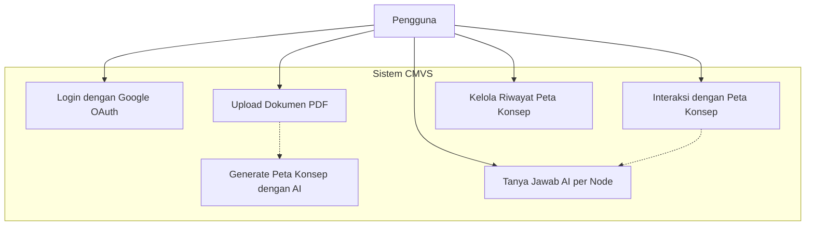
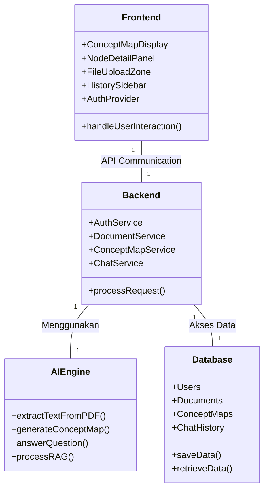
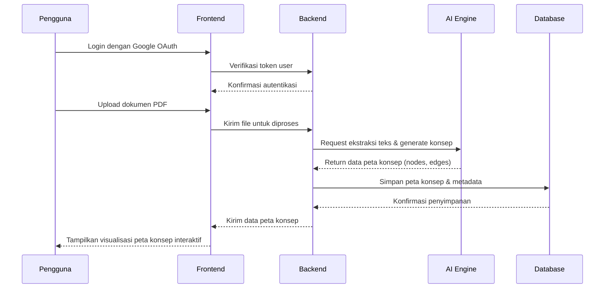
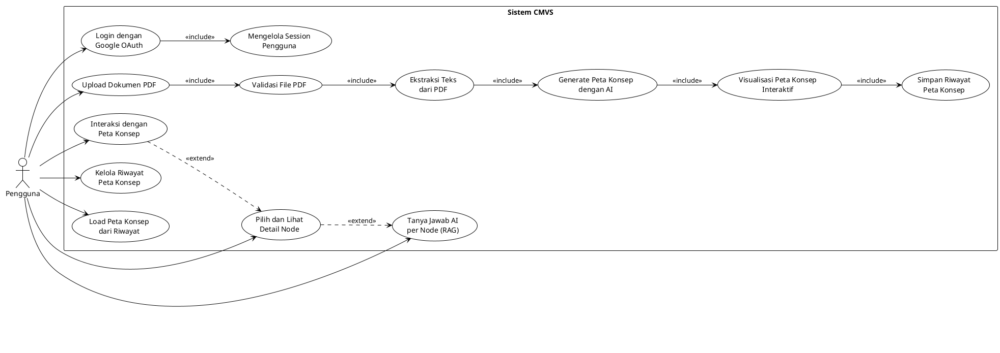

# Diagram Sistem Umum: AI-Powered Concept Map Visual Synthesizer (CMVS)

Dokumen ini berisi diagram-diagram tingkat tinggi (high-level) yang menggambarkan arsitektur dan alur kerja sistem CMVS dari perspektif umum, mencakup interaksi antara pengguna, frontend, dan backend.

---

## 1. Use Case Diagram (Mermaid)

**Deskripsi:** Diagram Use Case ini menggambarkan fungsionalitas utama yang dapat dilakukan oleh pengguna pada sistem CMVS. Diagram ini menunjukkan interaksi antara aktor (Pengguna) dengan sistem secara komprehensif.

---

## 2. Class Diagram (Mermaid)

**Deskripsi:** Class Diagram ini menyajikan komponen-komponen utama dalam sistem CMVS. Diagram ini menampilkan entitas kunci di frontend dan backend serta relasi dasarnya untuk memberikan gambaran struktur sistem secara umum.

---

## 3. Sequence Diagram (Mermaid)

**Deskripsi:** Sequence Diagram ini mengilustrasikan alur interaksi antar komponen sistem untuk skenario utama yaitu proses upload dokumen hingga peta konsep ditampilkan. Diagram ini menunjukkan urutan kejadian dan komunikasi antar komponen.

---

## 4. Use Case Diagram (PlantUML)

**Deskripsi:** Use Case Diagram dalam format PlantUML ini menggambarkan interaksi antara aktor utama (Pengguna) dengan sistem CMVS. Diagram ini mencakup semua use case utama dengan perspektif yang sama seperti diagram Mermaid di atas, menunjukkan fungsi-fungsi inti sistem secara komprehensif.

**Penjelasan Use Cases:**

1. **Login dengan Google OAuth** - Pengguna melakukan autentikasi menggunakan akun Google untuk mengakses sistem
2. **Mengelola Session Pengguna** - Sistem mengelola session dan validasi token pengguna secara otomatis
3. **Upload Dokumen PDF** - Pengguna mengunggah file PDF yang akan diproses menjadi peta konsep
4. **Validasi File PDF** - Sistem memvalidasi format, ukuran, dan integritas file yang diunggah
5. **Ekstraksi Teks dari PDF** - Sistem mengekstrak teks dari dokumen PDF menggunakan AI
6. **Generate Peta Konsep dengan AI** - AI menganalisis teks dan menghasilkan konsep serta relasi antar konsep
7. **Visualisasi Peta Konsep Interaktif** - Sistem menampilkan peta konsep dalam format visual yang interaktif
8. **Interaksi dengan Peta Konsep** - Pengguna dapat melakukan zoom, pan, dan navigasi pada peta konsep
9. **Pilih dan Lihat Detail Node** - Pengguna dapat memilih node tertentu untuk melihat informasi detail
10. **Tanya Jawab AI per Node (RAG)** - Pengguna dapat bertanya tentang konsep tertentu dan mendapat jawaban kontekstual
11. **Simpan Riwayat Peta Konsep** - Sistem menyimpan setiap peta konsep yang dihasilkan ke dalam database
12. **Kelola Riwayat Peta Konsep** - Pengguna dapat melihat, mencari, dan menghapus riwayat peta konsep
13. **Load Peta Konsep dari Riwayat** - Pengguna dapat memuat kembali peta konsep yang pernah dibuat sebelumnya

---

**Catatan:** Diagram ini memberikan gambaran umum arsitektur sistem CMVS. Implementasi detail dapat disesuaikan berdasarkan kebutuhan spesifik dan feedback dari testing.