# Diagram Sistem Umum: AI-Powered Concept Map Visual Synthesizer (CMVS)

Dokumen ini berisi diagram-diagram tingkat tinggi (high-level) yang menggambarkan arsitektur dan alur kerja sistem CMVS dari perspektif umum, mencakup interaksi antara pengguna, frontend, dan backend.

---

## 1. Use Case Diagram

**Deskripsi:** Diagram Use Case ini menggambarkan fungsionalitas utama yang dapat dilakukan oleh pengguna pada sistem CMVS. Diagram ini menunjukkan interaksi utama tanpa merinci proses teknis di baliknya.

---

## 2. Class Diagram

**Deskripsi:** Class Diagram ini menyajikan komponen-komponen utama dalam sistem CMVS secara umum. Diagram ini menampilkan kelas-kelas kunci di frontend dan backend serta relasi dasarnya untuk memberikan gambaran struktur sistem.

---

## 3. Sequence Diagram

**Deskripsi:** Sequence Diagram ini mengilustrasikan alur interaksi antar komponen sistem untuk skenario utama yaitu proses upload dokumen hingga peta konsep ditampilkan. Diagram ini menunjukkan urutan kejadian secara umum.

---

## 4. Use Case Diagram (PlantUML)

**Deskripsi:** Use Case Diagram dalam format PlantUML ini menggambarkan interaksi antara aktor utama (Pengguna) dengan sistem CMVS secara komprehensif. Diagram ini mencakup semua use case utama dari perspektif frontend dan backend dalam tingkat tinggi, menunjukkan fungsi-fungsi inti yang dapat dilakukan pengguna dalam sistem.

```plantuml
@startuml
!theme plain
left to right direction

' Aktor
actor "👤 Pengguna" as User

' Sistem boundary
rectangle {
  
  ' Use Cases - Autentikasi
  usecase "Melakukan Login\ndengan Google OAuth" as UC1
  usecase "Mengelola Session\nPengguna" as UC2
  
  ' Use Cases - Manajemen Dokumen
  usecase "Mengunggah\nDokumen PDF" as UC3
  usecase "Memvalidasi\nFile PDF" as UC4
  
  ' Use Cases - AI & Peta Konsep
  usecase "Mengekstrak Teks\ndari PDF" as UC5
  usecase "Menghasilkan\nPeta Konsep" as UC6
  usecase "Memvisualisasikan\nPeta Konsep" as UC7
  
  ' Use Cases - Interaksi
  usecase "Berinteraksi dengan\nPeta Konsep" as UC8
  usecase "Memilih dan Melihat\nDetail Node" as UC9
  usecase "Melakukan Tanya Jawab\ndengan AI (RAG)" as UC10
  
  ' Use Cases - Riwayat
  usecase "Menyimpan Riwayat\nPeta Konsep" as UC11
  usecase "Mengelola Riwayat\nPeta Konsep" as UC12
  usecase "Memuat Peta Konsep\ndari Riwayat" as UC13
}

' Koneksi User dengan Use Cases
User --> UC1
User --> UC3
User --> UC8
User --> UC9
User --> UC10
User --> UC12
User --> UC13

' Include relationships (horizontal)
UC1 --> UC2 : <<include>>
UC3 --> UC4 : <<include>>
UC4 --> UC5 : <<include>>
UC5 --> UC6 : <<include>>
UC6 --> UC7 : <<include>>
UC7 --> UC11 : <<include>>

' Extend relationships (optional)
UC8 ..> UC9 : <<extend>>
UC9 ..> UC10 : <<extend>>

@enduml
```

**Penjelasan Use Cases:**

1. **Melakukan Login dengan Google OAuth** - Pengguna melakukan autentikasi menggunakan akun Google untuk mengakses sistem
2. **Mengelola Session Pengguna** - Sistem mengelola session dan validasi token pengguna secara otomatis
3. **Mengunggah Dokumen PDF** - Pengguna mengunggah file PDF yang akan diproses menjadi peta konsep
4. **Memvalidasi File PDF** - Sistem memvalidasi format, ukuran, dan integritas file yang diunggah
5. **Mengekstrak Teks dari PDF** - Sistem mengekstrak teks dari dokumen PDF menggunakan AI
6. **Menghasilkan Peta Konsep** - AI menganalisis teks dan menghasilkan konsep serta relasi antar konsep
7. **Memvisualisasikan Peta Konsep** - Sistem menampilkan peta konsep dalam format visual yang interaktif
8. **Berinteraksi dengan Peta Konsep** - Pengguna dapat melakukan zoom, pan, dan navigasi pada peta konsep
9. **Memilih dan Melihat Detail Node** - Pengguna dapat memilih node tertentu untuk melihat informasi detail
10. **Melakukan Tanya Jawab dengan AI (RAG)** - Pengguna dapat bertanya tentang konsep tertentu dan mendapat jawaban kontekstual
11. **Menyimpan Riwayat Peta Konsep** - Sistem menyimpan setiap peta konsep yang dihasilkan ke dalam database
12. **Mengelola Riwayat Peta Konsep** - Pengguna dapat melihat, mencari, dan menghapus riwayat peta konsep
13. **Memuat Peta Konsep dari Riwayat** - Pengguna dapat memuat kembali peta konsep yang pernah dibuat sebelumnya

---

**Catatan:** Diagram ini memberikan gambaran umum arsitektur sistem CMVS. Implementasi detail dapat disesuaikan berdasarkan kebutuhan spesifik dan feedback dari testing.