# Diagram Sistem Umum: AI-Powered Concept Map Visual Synthesizer (CMVS)

Dokumen ini berisi diagram-diagram tingkat tinggi (high-level) yang menggambarkan arsitektur dan alur kerja sistem CMVS dari perspektif umum, mencakup interaksi antara pengguna, frontend, dan backend.

---

## 1. Activity Diagram (PlantUML)

**Deskripsi:** Activity Diagram ini menggambarkan alur kerja (workflow) lengkap dari sistem CMVS, mulai dari pengguna login hingga mendapatkan peta konsep yang dapat diinteraksikan. Diagram ini menunjukkan aktivitas sequential dan decision points dalam proses.

### 1.1 Activity Diagram (Complete)


### 1.2 Activity Diagram (Simplified)


---

## 2. Use Case Diagram (Mermaid)

**Deskripsi:** Diagram Use Case ini menggambarkan fungsionalitas utama yang dapat dilakukan oleh pengguna pada sistem CMVS. Diagram ini menunjukkan interaksi antara aktor (Pengguna) dengan sistem secara komprehensif.


---

## 2. Class Diagram

**Deskripsi:** Class Diagram ini menyajikan komponen-komponen utama dalam sistem CMVS. Diagram ini menampilkan entitas kunci di frontend dan backend serta relasi dasarnya untuk memberikan gambaran struktur sistem secara umum.

### 2.1 Class Diagram (Mermaid)


### 2.2 Class Diagram (PlantUML)


---

## 3. Sequence Diagram

**Deskripsi:** Sequence Diagram ini mengilustrasikan alur interaksi antar komponen sistem untuk skenario utama yaitu proses upload dokumen hingga peta konsep ditampilkan. Diagram ini menunjukkan urutan kejadian dan komunikasi antar komponen.

### 3.1 Sequence Diagram (Mermaid)


### 3.2 Sequence Diagram (PlantUML)


---

## 4. Use Case Diagram (PlantUML)

**Deskripsi:** Use Case Diagram dalam format PlantUML ini menggambarkan interaksi antara aktor utama (Pengguna) dengan sistem CMVS. Diagram ini mencakup semua use case utama dengan perspektif yang sama seperti diagram Mermaid di atas, menunjukkan fungsi-fungsi inti sistem secara komprehensif.


**Penjelasan Use Cases:**

1. **Login dengan Google OAuth** - Pengguna melakukan autentikasi menggunakan akun Google untuk mengakses sistem
2. **Mengelola Session Pengguna** - Sistem mengelola session dan validasi token pengguna secara otomatis
3. **Upload Dokumen PDF** - Pengguna mengunggah file PDF yang akan diproses menjadi peta konsep
4. **Validasi File PDF** - Sistem memvalidasi format, ukuran, dan integritas file yang diunggah
5. **Ekstraksi Teks dari PDF** - Sistem mengekstrak teks dari dokumen PDF menggunakan AI
6. **Generate Peta Konsep dengan AI** - AI menganalisis teks dan menghasilkan konsep serta relasi antar konsep
7. **Visualisasi Peta Konsep Interaktif** - Sistem menampilkan peta konsep dalam format visual yang interaktif
8. **Interaksi dengan Peta Konsep** - Pengguna dapat melakukan zoom, pan, dan navigasi pada peta konsep
9. **Pilih dan Lihat Detail Node** - Pengguna dapat memilih node tertentu untuk melihat informasi detail
10. **Tanya Jawab AI per Node (RAG)** - Pengguna dapat bertanya tentang konsep tertentu dan mendapat jawaban kontekstual
11. **Simpan Riwayat Peta Konsep** - Sistem menyimpan setiap peta konsep yang dihasilkan ke dalam database
12. **Kelola Riwayat Peta Konsep** - Pengguna dapat melihat, mencari, dan menghapus riwayat peta konsep
13. **Load Peta Konsep dari Riwayat** - Pengguna dapat memuat kembali peta konsep yang pernah dibuat sebelumnya
14. **Logout** - Pengguna keluar dari sistem dan mengakhiri session aktif

---

## 6. Use Case Descriptions

### UC1: Login dengan Google OAuth
**Aktor:** Pengguna  
**Deskripsi:** Pengguna melakukan autentikasi ke sistem menggunakan akun Google mereka  
**Precondition:** Pengguna memiliki akun Google yang valid  
**Postcondition:** Pengguna berhasil terautentikasi dan mendapat akses ke sistem  
**Flow:**
1. Pengguna mengklik tombol "Login with Google"
2. Sistem mengarahkan ke halaman OAuth Google
3. Pengguna memasukkan kredensial Google
4. Google mengirim token ke sistem
5. Sistem memvalidasi token dan membuat session
6. Pengguna diarahkan ke dashboard

### UC2: Upload Dokumen PDF
**Aktor:** Pengguna  
**Deskripsi:** Pengguna mengunggah file PDF untuk diproses menjadi peta konsep  
**Precondition:** Pengguna sudah login ke sistem  
**Postcondition:** File PDF berhasil diunggah dan siap diproses  
**Flow:**
1. Pengguna memilih file PDF dari device
2. Sistem memvalidasi format dan ukuran file
3. File diunggah ke server
4. Sistem mengkonfirmasi upload berhasil

### UC3: Generate Peta Konsep dengan AI
**Aktor:** Sistem AI  
**Deskripsi:** AI menganalisis dokumen PDF dan menghasilkan peta konsep  
**Precondition:** File PDF telah berhasil diunggah  
**Postcondition:** Peta konsep dengan nodes dan edges berhasil dibuat  
**Flow:**
1. Sistem ekstrak teks dari PDF
2. AI menganalisis konten dan mengidentifikasi konsep utama
3. AI menentukan relasi antar konsep
4. Sistem membuat struktur peta konsep (nodes + edges)
5. Data peta konsep disimpan ke database

### UC4: Interaksi dengan Peta Konsep
**Aktor:** Pengguna  
**Deskripsi:** Pengguna berinteraksi dengan visualisasi peta konsep  
**Precondition:** Peta konsep telah berhasil dibuat dan ditampilkan  
**Postcondition:** Pengguna dapat menavigasi dan mengeksplorasi peta konsep  
**Flow:**
1. Pengguna melihat visualisasi peta konsep
2. Pengguna dapat zoom in/out
3. Pengguna dapat melakukan pan/drag
4. Pengguna dapat mengklik node untuk detail
5. Sistem merespons setiap interaksi dengan smooth

### UC5: Tanya Jawab AI per Node
**Aktor:** Pengguna, Sistem AI  
**Deskripsi:** Pengguna bertanya tentang konsep tertentu dan mendapat jawaban kontekstual  
**Precondition:** Pengguna telah memilih node tertentu pada peta konsep  
**Postcondition:** Pengguna mendapat jawaban yang relevan tentang konsep tersebut  
**Flow:**
1. Pengguna mengklik node spesifik
2. Panel detail node terbuka
3. Pengguna mengetik pertanyaan tentang konsep
4. Sistem memproses pertanyaan dengan RAG
5. AI memberikan jawaban berdasarkan konten dokumen
6. Jawaban ditampilkan di chat interface

### UC6: Kelola Riwayat Peta Konsep
**Aktor:** Pengguna  
**Deskripsi:** Pengguna mengelola riwayat peta konsep yang pernah dibuat  
**Precondition:** Pengguna sudah login dan memiliki riwayat peta konsep  
**Postcondition:** Pengguna dapat mengakses, mencari, atau menghapus riwayat  
**Flow:**
1. Pengguna membuka sidebar riwayat
2. Sistem menampilkan daftar peta konsep sebelumnya
3. Pengguna dapat mencari berdasarkan nama/tanggal
4. Pengguna dapat memilih peta konsep untuk dibuka kembali
5. Pengguna dapat menghapus riwayat yang tidak diperlukan

---

## 7. General Architecture & Deployment

### 7.1 General Architecture

**Deskripsi:** Arsitektur umum sistem CMVS menggunakan pola client-server dengan pemisahan yang jelas antara frontend dan backend. Sistem dibangun dengan prinsip microservices dan RESTful API untuk memastikan scalability dan maintainability.

#### 7.1.1 Architecture Diagram (Mermaid)

```mermaid
graph TB
    subgraph "Client Layer (Netlify)"
        FE[Frontend - Next.js<br/>🔧 Built with GitHub Actions]
        FE --> |HTTPS/REST API| API
    end
    
    subgraph "Server Layer (Render) - Python"
        API[Monolithic FastAPI Server<br/>🔧 Built with GitHub Actions]
        AUTH[Authentication Service]
        DOC[Document Processing Service]
        AI[AI Processing Service]
        CHAT[Chat/RAG Service]
        
        API -.-> AUTH
        API -.-> DOC
        API -.-> AI
        API -.-> CHAT
    end
    
    subgraph "Data Layer"
        DB[(MongoDB Atlas)]
        S3[Cloudflare R2 Storage]
        
        AUTH --> DB
        DOC --> S3
        AI --> DB
        CHAT --> DB
    end
    
    subgraph "External Services"
        GOOGLE[Google OAuth]
        GroqCloud["Llama3 (GroqCloud API)"]

        AUTH --> GOOGLE
        AI --> GroqCloud
        CHAT --> GroqCloud
    end
    
    subgraph "CI/CD"
        GHA[GitHub Actions<br/>🔄 Build & Deploy Pipeline]
        GHA -.-> FE
        GHA -.-> API
    end
```


**Catatan Arsitektur:**
- **Server Layer**: Menggunakan Python dengan FastAPI sebagai monolithic application
- **Deployment**: Frontend di Netlify, Backend di Render  
- **CI/CD**: GitHub Actions untuk build dan deploy otomatis (FE & BE)
- **Services**: Meskipun monolithic, kode diorganisir dalam service layers yang terpisah

#### 7.1.2 Architecture Diagram (PlantUML)


**Catatan Arsitektur:**
- **Monolithic Design**: Single FastAPI application dengan service layers terorganisir
- **Python Backend**: Seluruh server layer menggunakan Python
- **Deployment Platforms**: Frontend → Netlify, Backend → Render
- **CI/CD**: GitHub Actions untuk automated build dan deployment
- **Service Organization**: Meskipun monolithic, kode tetap terstruktur dalam service layers

### 7.2 Frontend Architecture (Next.js)

**Framework:** Next.js 14 dengan App Router  
**Styling:** Tailwind CSS + Shadcn/ui  
**State Management:** Zustand  
**Authentication:** NextAuth.js  
**Key Features:**
- Server-side rendering (SSR) untuk SEO optimization
- Client-side routing untuk smooth navigation
- Responsive design dengan mobile-first approach
- Real-time updates menggunakan WebSocket/polling
- Progressive Web App (PWA) capabilities

**Component Structure:**
- **Layout Components:** AppLayoutWrapper, MobileHeader
- **Auth Components:** AuthDialog, GoogleAuthProvider
- **Core Components:** HierarchicalMindMapDisplay, NodeDetailPanel
- **Utility Components:** FileDropZone, HistorySidebar, ThemeProvider

### 7.3 Backend Architecture (FastAPI)

**Framework:** FastAPI dengan Python 3.11+  
**Database:** MongoDB Atlas  
**File Storage:** Cloudflare R2  
**Caching:** Redis  
**AI Integration:** Llama3 (GroqCloud API)  
**Key Features:**
- Asynchronous request handling untuk performance
- Automatic API documentation dengan Swagger/OpenAPI
- JWT-based authentication dengan refresh tokens
- File processing dengan background tasks
- Rate limiting dan error handling

**Service Structure:**
- **Auth Service:** User authentication dan session management
- **Document Service:** PDF upload, validation, dan text extraction
- **AI Service:** Concept map generation dengan Llama3 (GroqCloud API)
- **Chat Service:** RAG implementation untuk Q&A
- **User Service:** User profile dan preferences management

### 7.4 Deployment Architecture

#### CI/CD Pipeline (GitHub Actions)

**Build & Deployment Process:**

- **Frontend (Next.js)**: 
  - GitHub Actions workflow triggers pada push ke main branch
  - Build process: `npm run build` 
  - Deploy target: Netlify
  - Build artifacts: Static files di `out/` directory

- **Backend (FastAPI)**:
  - GitHub Actions workflow triggers pada push ke main branch  
  - Build process: `pip install -r requirements.txt`
  - Deploy target: Render
  - Build artifacts: Python application bundle

#### Frontend Deployment (Netlify)

**Platform:** Netlify  
**Build Process:** 
- Automatic builds dari GitHub repository
- Build command: `npm run build`
- Deploy dari `frontend/` directory

**Features:**
- CDN global untuk fast loading
- Automatic HTTPS dengan custom domain
- Branch previews untuk testing
- Form handling untuk contact/feedback
- Analytics dan performance monitoring

**Configuration (netlify.toml):**
```toml
[build]
  base = "frontend/"
  command = "npm run build"
  publish = "out/"

[build.environment]
  NODE_VERSION = "18"

[[redirects]]
  from = "/api/*"
  to = "https://cmvs-backend.render.com/api/:splat"
  status = 200
```

#### Backend Deployment (Render)

**Platform:** Render  
**Service Type:** Web Service  
**Build Process:**
- Automatic builds dari GitHub repository
- Build command: `pip install -r requirements.txt`
- Start command: `python uvicorn_runner.py`

**Features:**
- Automatic HTTPS dan custom domain
- Auto-scaling berdasarkan traffic
- Health checks dan monitoring
- Database connection pooling

#### Database & Storage

**MongoDB Atlas:**
- Cloud-hosted MongoDB dengan auto-scaling
- Global clusters untuk low latency
- Automatic backups dan point-in-time recovery
- Built-in security dengan IP whitelisting

**Cloudflare R2:**
- File storage untuk uploaded PDFs
- Lifecycle policies untuk cost optimization
- CloudFront CDN untuk fast file delivery
- Versioning dan backup capabilities

#### Monitoring & Analytics

**Monitoring Tools:**
- Render native monitoring untuk backend
- Netlify Analytics untuk frontend
- MongoDB Atlas monitoring untuk database
- Custom logging dengan structured logs

**Performance Metrics:**
- API response times
- File processing duration
- User engagement metrics
- Error rates dan uptime monitoring

---

**Catatan:** Diagram ini memberikan gambaran umum arsitektur sistem CMVS. Implementasi detail dapat disesuaikan berdasarkan kebutuhan spesifik dan feedback dari testing.