# Diagram Sistem Umum: AI-Powered Concept Map Visual Synthesizer (CMVS)

Dokumen ini berisi diagram-diagram tingkat tinggi (high-level) yang menggambarkan arsitektur dan alur kerja sistem CMVS dari perspektif umum, mencakup interaksi antara pengguna, frontend, dan backend.

---

## 1. Use Case Diagram

**Deskripsi:** Diagram Use Case ini menggambarkan fungsionalitas utama yang dapat dilakukan oleh pengguna pada sistem CMVS. Diagram ini menunjukkan interaksi utama tanpa merinci proses teknis di baliknya.

```mermaid
graph TD
    Pengguna[👤 Pengguna]

    subgraph "Sistem CMVS"
        UC1[Autentikasi Pengguna]
        UC2[Upload Dokumen PDF]
        UC3[Generate Peta Konsep]
        UC4[Interaksi dengan Peta Konsep]
        UC5[Tanya Jawab AI]
        UC6[Kelola Riwayat]
    end

    Pengguna --> UC1
    Pengguna --> UC2
    Pengguna --> UC4
    Pengguna --> UC5
    Pengguna --> UC6
    UC2 -.-> UC3
    UC4 -.-> UC5
```

---

## 2. Class Diagram

**Deskripsi:** Class Diagram ini menyajikan komponen-komponen utama dalam sistem CMVS secara umum. Diagram ini menampilkan kelas-kelas kunci di frontend dan backend serta relasi dasarnya untuk memberikan gambaran struktur sistem.

---

## 3. Sequence Diagram

**Deskripsi:** Sequence Diagram ini mengilustrasikan alur interaksi antar komponen sistem untuk skenario utama yaitu proses upload dokumen hingga peta konsep ditampilkan. Diagram ini menunjukkan urutan kejadian secara umum.

```mermaid
sequenceDiagram
    participant U as 👤 Pengguna
    participant F as 🖥️ Frontend
    participant B as ⚙️ Backend
    participant AI as 🤖 AI Engine
    participant DB as 🗄️ Database

    U->>F: 1. Upload dokumen PDF
    F->>B: 2. Kirim request proses dokumen
    B->>AI: 3. Request ekstraksi & generate konsep
    AI-->>B: 4. Return data peta konsep
    B->>DB: 5. Simpan hasil ke database
    DB-->>B: 6. Konfirmasi penyimpanan
    B-->>F: 7. Kirim data peta konsep
    F-->>U: 8. Tampilkan visualisasi peta konsep
```

---

**Catatan:** Diagram ini memberikan gambaran umum arsitektur sistem CMVS. Implementasi detail dapat disesuaikan berdasarkan kebutuhan spesifik dan feedback dari testing.
